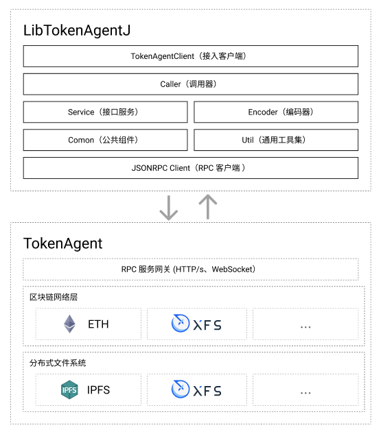

# LibTokenAgentJ

该项目是基于 `TokenAgent` 区块链通证代理服务提供区块链底层支撑能力，使用 JAVA 语言编写并封装的开发工具包。 



## 使用方法

```xml
<dependency>
    <groupId>com.esiran</groupId>
    <artifactId>libtokenagentj-core</artifactId>
</dependency>
```

更多使用示例请参考 [libtokenagetj-example](./libtokenagentj-example) 示例目录。

### 示例目录结构说明

```text
libtokenagentj-example/src/main/java/com/esiran/libtokenagentj/example
| -- CollectionCallerUsage.java # 合集调用器使用示例
| -- CommonParams.java # 公共参数设置
| -- SimpleKeyItem.java # 简易密钥实例
| -- TokenAgentClientUsage.java # 通证代理客户端使用示例
| -- TokenCallerUsage.java # 通证调用器使用示例
```

### 通证代理客户端（TokenAgentClient）

查看并编辑 `TokenAgentClientUsage.java` 文件，将会看到通证代理客户端的常规使用方法的示例程序。

执行 `main` 方法将会使用程序内置的私钥创建符合 [ERC-721](https://eips.ethereum.org/EIPS/eip-721) 标准的范式合约。

> 合集是业务层的概念是由合约抽象出来的，一般描述合集=合约，表述上不做区分。

构造 `TokenAgentClient` 实例时需要提供 RPC 客户端并且设置一个网络标识。 如以下示例：

```text
RPCClient rpcClient = new HTTPClient("https://example.org");
TokenAgentClient tokenAgentClient = new TokenAgentClient(rpcClient, "ETH_MAINNET");
```

`tokenagent` 底层服务提供了多链接入，故需要设置 `blockchain` 字段用于选择区分底层的区块链网络。
以下为现目前受支持网络标识列表：


| 网络标识               | 描述                     |
|:-------------------|:-----------------------|
| ETH_MAINNET        | 以太坊 MAINNET - 主网       |
| ETH_RINKEBY        | 以太坊 RINKEBY - 测试网      |
| ETH_GANACHE        | 以太坊 GANACHE - 测试网      |
| ETH_POLYGON        | 以太坊协议 POLYGON 侧链 - 主网  |
| ETH_POLYGON_MUMBAI | 以太坊协议 POLYGON 侧链 - 测试网 |


接下来可以使用 `TokenAgentClient.createCollection` 方法创建一个合约时
如以下参数设置表示在 `RINKEBY` 网络中创建一个名称为：`HelloWorld` 的合集：

```text
...
CollectionCreateParams params = new CollectionCreateParams();
params.setName("HelloWorld");
params.setSymbol("hw");
String contractUri = String.format("https://example.org/%s", params.getName());
params.setContractUri(contractUri);
params.setTokenUriPrefix("https://ipfs.io/ipfs/");
params.setSignerAddress(randomAddress);
CollectionCreateResult result = tokenAgentClient.createCollection(params, privateKey);
```

其中 `contractUri` 表示业务层的访问地址，该地址由业务层自行处理。
`tokenUriPrefix` 字段表示合集内所有通证的访问路径前缀，示例中使用 IPFS 作为通证的内容托管服务
（注：该字段只是前缀，应该与下文中的藏品访问路径结合）。

构造必要的创建参数后，可以使用 `TokenAgentClient` 提供的内置方法创建合集，
当然此步骤需要提供私钥进行签名。

有关更多参数的解释，查看源码注释详细了解。

示例代码内硬编码了一个静态的十六进制文本私钥，以及一个随机创建的私钥。
这是一个必要的设定，根据区块链的特性以及为了系统安全，任何相关交易的交互需要由上层应用的私钥进行离线签名。
以下示例方式可以导入一个静态的十六进制文本私钥：

```text
SimpleKeyItem.createSimpleKeyItemOfHex("9a965d17bbb921951c681f37b5301b2d50cb8ed4185fb284cd19962357f6c8ac");
```
当然也可以创建一个随机的私钥：
```text
SimpleKeyItem.createRandomKeyItem(),
```
上述私钥的创建和导入方式都是示例不推荐直接使用，请参考源码并且自行在业务层进行封装。

### 合集调用器（CollectionCaller）

在 `CollectionCallerUsage.java` 文件内是有关合集调用器的使用示例。示例中演示了如何获取已有合集的基本属性，以及调用合集的铸造方法。

> （数字）藏品是业务层抽象的概念，一般将藏品=ERC721-TOKEN（NFT, 非同质化代币） 不作概念区分。藏品与合集是从属关系，
> 也就意味着一个藏品必然隶属于一个合集，并且一个合集可以包含多个藏品。数字藏品使用唯一的 `tokenId` 保证在合集内的唯一性。

使用 `TokenAgentClient.newCollection` 方法可以实例化一个的合集调用器

```text
...
CollectionCallerParams params = new CollectionCallerParams();
// 合约地址
String addressHex = "0xc17d0b6539916ed60b6e90d2d903a0c10204f533";
Address contractAddress = Address.ofHex(addressHex);
params.setAddress(contractAddress);
// 构造调用器
CollectionCaller collectionCaller = tokenAgentClient.newCollection(params);
```

调用器 `CollectionCaller` 是合集的实例对象，因此提供了一些标准的操作方法，例如通过调用器获取合集的名称和符号等属性，示例如下：

```text
// 获取合集名称
String name = collectionCaller.getName();
// 获取合集符号
String symbol = collectionCaller.getSymbol();
```

使用调用器铸造藏品时需要一些必要的参数设置，包括在调用合约内唯一的 `tokenId`，并且提供铸造者的私钥进行签名，参考以下示例：

```text
...
NFTMintParam nftMintParam = new NFTMintParam();
Integer tokenId = 10091;
nftMintParam.setTokenId(tokenId);
nftMintParam.setTokenUri("example.png");
Hash txHash = collectionCaller.mintToken(nftMintParam, privateKey);
```

通证代理客户端 `TokenAgentClient` 同时提供了接入 IPFS 文件上传服务。
按照以下方式可以将文件上传至 IPFS，如果成功将会返回由 IPFS 提供的文件 ID 信息。
以下示例将文件上传至 IPFS，并且将文件路径作为通证的全局唯一的 URI：

```text
String filename = "example.gif";
URL url = ClassLoader.getSystemResource(filename);
File file = new File(url.toURI());
String fileCid = tokenAgentClient.uploadFileToIPFS(file);
...
nftMintParam.setTokenUri(fileCid);
```


### 通证（Token）/ 藏品调用器（TokenCaller）

与合集调用器类似地使用 `TokenAgentClient.newToken` 方法将合集内的藏品实例化，并提供了标准的操作方法。以下是通证调用器的构造示例：

```text
Address contractAddress = Address.ofHex("0xc17d0b6539916ed60b6e90d2d903a0c10204f533");
params.setTokenId(new BigInteger("0xff", 16));
params.setContractAddress(contractAddress);
// 构造调用器
TokenCaller caller = tokenAgentClient.newToken(params);
```

构造通证调用器（TokenCaller）需要合约地址以及通证 ID 作为参数进行实例化。

常规的属性获取，可以使用调用器提供的标准方法进行。例如以下示例中获取藏品 URI（铸造时提供的访问地址）：

```text
String tokenUri = caller.getTokenUri();
```

### 通证转移

通过通证调用器（TokenCaller）可以完成通证的常规转移操作。

```text
Address toAddress = ...;
byte[] privateKey = ...;
Hash txHash = caller.transfer(toAddress, privateKey);
```

上述示例将会使用发送交易签名的私钥 `privateKey` 导出区块链地址作为原持有人 `fromAddress`，
并且将实例化的通证转移到目标地址 `toAddress`。
完成上述流程，需要熟悉区块链签名验证机制以及地址导出规则，相关概念本文档概不释义，自行参阅相关资料。

除了原持有地址拥有权限完成通证转移流程，也可以利用通证授权机制，赋予其他地址拥有执行转移操作的权限，但不持有该通证。
例如以下示例，将授予一个随机的地址转移权限：

```text
Address randomAddress = ...;
byte[] privateKey = ...;
Hash txHash = caller.approve(randomAddress, privateKey);
```

授权操作需要由当前持有人发起，因此在一般业务场景内需要提供私钥对此操作行为进行签名。